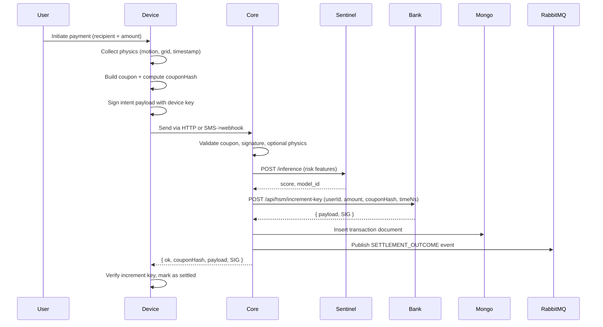
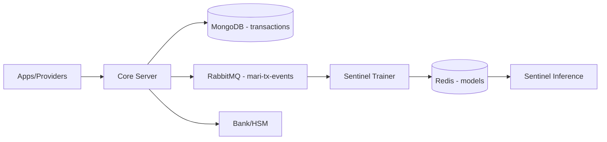

# Mari Protocol Whitepaper (Single Source of Truth)

## 0. Executive Summary

- **Mari Protocol** is a digital payment protocol where devices create signed, physics‑bound payment "coupons" that are:
  - Validated and risk‑scored by a dedicated ML engine (**Sentinel**), and
  - Settled by a bank‑like ledger and HSM (**Bank/HSM**) that issues cryptographic proofs of payment.
- **Finality** occurs only when the Bank/HSM issues a signed increment key and the client verifies it.
- **Rails**:
  - **HTTP** – online, low‑latency API calls from apps/services to Mari Core.
  - **SMS** – offline/low‑connectivity rail that carries the same coupon data via SMS.
- **Design goals**:
  - Stronger fraud resistance (device, physics, ML risk) without storing excessive PII.
  - Clear separation between **core protocol** and **regulated ledger** responsibilities.
  - Full auditability across intent → risk → settlement → outcomes.
- **Non‑goals**:
  - No penalties, interest, or credit products in the protocol.
  - No KYC/AML engine in core – those live with the bank/ledger operator.

---

## 1. Motivation & Problem Space

- **Traditional rails** (cards, basic wallets) have limitations:
  - Limited visibility into device context, physics, and user behavior.
  - Risk signals are often opaque and buried inside bank/card networks.
  - Poor support for low‑connectivity settings where SMS is more reliable than data.
- **Mari’s core idea**:
  - Represent a payment as a **physics‑bound coupon** which encodes:
    - Payer and payee (via pseudonymous IDs).
    - Amount.
    - Coarse location grid.
    - Motion‑derived seal.
    - Expiry timestamp.
  - Use a **separate risk engine (Sentinel)** to score transactions before settlement.
  - Use a **bank/HSM** to maintain balances and issue signed settlement proofs.
- **Target environments**:
  - Regions with intermittent/expensive data but strong SMS coverage.
  - Ecosystems where Android is dominant and low‑end devices are common.

---

## 2. High‑Level Architecture

### 2.1 Components

- **Mari Core (`mari-server`)**
  - HTTP API for:
    - Device registration (`/api/transactions/register-device`).
    - Transaction submission (`/api/transactions`).
    - Batch settlement (`/api/settlement/process`).
  - Responsibilities:
    - Validate coupons, signatures, optional physics.
    - Call Sentinel for risk scoring.
    - Call Bank/HSM for settlement.
    - Persist transaction journals in MongoDB.
    - Publish label events for Sentinel training.

- **Mari Sentinel (`mari-sentinel`)**
  - Inference service:
    - Exposes `/inference` for real‑time risk scoring.
    - Uses models stored in Redis (ONNX).
  - Trainer and pipeline:
    - Consumes `TransactionEvent` messages from RabbitMQ.
    - Builds labeled examples and trains models.
    - Hot‑swaps models using Redis pub/sub.

- **Bank/HSM (`mock-bank-hsm`)**
  - Bank account & reserve logic:
    - Maintains balances for users and merchants.
    - Manages reserve accounts keyed by bio hashes.
  - Settlement logic:
    - Processes batch settlement (`/api/settlement/process`).
    - Applies protocol and bank commissions.
  - HSM:
    - Issues increment keys (`/api/hsm/increment-key`).
    - Verifies increment keys (`/api/hsm/verify`).

- **Shared Libraries (`mari-shared-libs`)**
  - Coupon parsing and generation (`MariStringParser`).
  - Physics-related utilities (grids, seals).
  - Converters and validators.

- **Mari App (`mari-app`)**
  - Reference Android demo client.
  - Demonstrates:
    - Device key management (Android Keystore).
    - Coupon generation and signing.
    - HTTP + SMS flows.
    - Basic send/receive UX.

### 2.2 Data Flow Overview

---

## 3. Data Model & Identifiers

### 3.1 Pseudonymous Identifiers

- **Bio hashes**
  - `senderBioHash`, `receiverBioHash`.
  - Represent users in a pseudonymous manner.
- **Device key IDs (`kid`)**
  - Short 8‑hex identifiers.
  - Derived from SPKI (public key) hash.
- **User IDs in bank context (`USER_ID`)**
  - Used by Bank/HSM to index per‑user increment key versions.

### 3.2 Coupons (Transfer Intent)

- **String form**
  - `Mari://xfer?from=...&to=...&val=...&g=...&exp=...&s=...`
- **Core parameters**
  - `from` – payer bio hash.
  - `to` – payee bio hash.
  - `val` – amount.
  - `g` – location grid (coarse cell).
  - `exp` – expiry timestamp (ms since epoch).
  - `s` – motion‑derived seal (8‑hex string).
- **Coupon hash**
  - `couponHash = SHA-256(coupon_string)` (hex 64 chars).
  - Used for idempotency and joins across systems.

### 3.3 Physics Snapshot (`physicsData`)

- Optional but recommended.
- Shape:
  - `location.grid: string` – matches or approximates coupon `g`.
  - `motion.x/y/z: number` – motion vector.
  - `timestamp: string|number|Date` – client-side time.
- Stored as embedded object in `Transaction` documents when present.

### 3.4 Core Transaction (MongoDB)

- Collection: `transactions`
- Fields:
  - `transactionId: string` (`TXN_<timestamp>_<uuid>`).
  - `senderBioHash`, `receiverBioHash`.
  - `amount: number`.
  - `locationGrid: string`.
  - `coupon: string`.
  - `physicsData` (optional snapshot).
  - `transportMethod: 'HTTP' | 'SMS'`.
  - `status: 'PENDING' | 'SETTLED' | 'FAILED'`.
  - `createdAt`, `updatedAt` (Mongoose timestamps).

### 3.5 Settlement Proof (Increment Key)

- **Per-user increment key payload**:
  - `USER_ID: string`.
  - `AMOUNT: number`.
  - `COUPON_HASH: string`.
  - `TIME_NS: number`.
  - `VERSION: number` (monotonic per user).
  - `HSM_KID: string`.
- **Signature**:
  - `SIG: string` – RSA‑PSS‑SHA256 over canonical JSON.

### 3.6 Events for Training (`TransactionEvent`)

- Fields:
  - `event_id: string`.
  - `event_type: 'PRE_SETTLEMENT' | 'SETTLEMENT_OUTCOME'`.
  - `coupon_hash: string`.
  - `kid: string`.
  - `expiry_ts: number`.
  - `seal: string`.
  - `grid_id: string`.
  - `amount: number`.
  - `result?: 'SUCCESS' | 'DUPLICATE' | 'INVALID_SIG' | 'ERROR'`.

---

## 4. Payment Flows

### 4.1 HTTP Rail (Online)

- **Client responsibilities**:
  - Generate coupon and physics snapshot.
  - Build canonical payload `{ from, to, amount, grid, coupon }` and sign with device key.
  - POST JSON to `/api/transactions` with:
    - `from`, `to`, `grid`.
    - `kid`, `sig`.
    - `amount`, `coupon`.
    - Optional `physicsData`.

- **Core behavior**:
  - Normalize fields (legacy vs new shapes).
  - Compute `couponHash` and reject duplicates.
  - Verify signature using `kid` → `spki` from device registry.
  - Optionally validate physics.
  - Call Sentinel for risk.
  - Proceed to Bank/HSM if approved.
  - Persist transaction and publish label events.

### 4.2 SMS Rail (Offline / Low Connectivity)

- **Client responsibilities**:
  - Encode coupon into SMS text.
  - Send to dedicated gateway number.

- **Server behavior**:
  - SMS provider posts to Core’s SMS webhook.
  - Core extracts coupon and maps it into the same `/api/transactions` logic.
  - From that point onward, HTTP and SMS paths are identical.

### 4.3 Batch Settlement for Merchants

- **When used**:
  - Payroll, merchant settlement, or bulk payouts.

- **Core endpoint**:
  - `POST /api/settlement/process`.

- **Payload**:
  - `batchId: string`.
  - `merchantId: string` (core-side ID).
  - `bankMerchantId: string` (bank-side merchant account ID).
  - `seal: string` (batch seal over `{id, amount}` items).
  - `transactions: Array<{ id, amount, coupon, physicsData? }>`.

- **Flow**:
  - Core forwards normalized payload to Bank/HSM.
  - Bank validates coupons and amounts, applies commissions, updates merchant balance.
  - Bank returns settlement summary + batch increment key.
  - Core forwards response to caller and can log/persist as needed.

---

## 5. Sentinel Risk Engine

### 5.1 Inference API

- **Endpoint**:
  - `POST /inference` on `mari-sentinel`.
- **Request (InferenceRequest)**:
  - `coupon_hash: string`.
  - `kid: string`.
  - `expiry_ts: number`.
  - `seal: string`.
  - `grid_id: string`.
  - `amount: number`.
- **Response (InferenceResponse)**:
  - `score: number` (0–999).
  - `model_id: string`.

### 5.2 Features

- Sentinel featurizer converts an InferenceRequest into an 8‑dimensional Float32Array:
  - Hashed device ID: `hashCode(kid) % 10000`.
  - Hashed seal: `hashCode(seal) % 10000`.
  - Hashed grid: `hashCode(grid_id) % 1000`.
  - Amount.
  - Time to expiry: `expiry_ts - now`.
  - `hashSeen` (currently 0; reserved for replay features).
  - Coupon hash prefix: `parseInt(coupon_hash.slice(0,2), 16)`.
  - Coupon hash suffix: `parseInt(coupon_hash.slice(-2), 16)`.

### 5.3 Model & Decision Policy

- Model:
  - RandomForest classifier exported to ONNX.
  - Loaded from Redis; hot‑swapped via pub/sub.
- Score:
  - Raw model output in [0,1], scaled to `score = round(s * 999)`.
- Policy in Core:
  - If Sentinel unreachable and `SENTINEL_FAIL_OPEN=false` → reject with `sentinel_unavailable`.
  - If `score > SENTINEL_THRESHOLD` → reject with `high_risk_transaction`.
  - Otherwise → proceed to settlement.

### 5.4 Training Pipeline

- Core publishes:
  - `PRE_SETTLEMENT` events before settlement.
  - `SETTLEMENT_OUTCOME` events after settlement, with `result`.
- Trainer:
  - Matches `PRE_SETTLEMENT` and `SETTLEMENT_OUTCOME` by `coupon_hash`.
  - Featurizes based on `PRE_SETTLEMENT` event.
  - Labels `SUCCESS` as positive and other results as negative.
  - Accumulates labeled examples and trains new models.
- Model deployment:
  - Models stored as `model:<id>` in Redis.
  - `model:current` points to active model.
  - Inference service subscribes to `model-updates` channel and hot‑swaps models.

---

## 6. Physics & Location Security

### 6.1 Purpose

- Provide additional signals to:
  - Discriminate between genuine device motions and bots.
  - Detect inconsistent or suspicious location usage.
- Physics is a **soft control** feeding risk, not a cryptographic guarantee.

### 6.2 Components

- **Location grids**
  - Coarse cell IDs derived from GPS or similar.
  - Avoid storing raw coordinates server‑side.
- **Motion seal**
  - 8‑hex string derived from motion data.
  - Encoded into coupon as `s`.
- **Expiry**
  - Coupon `exp` parameter and `expiry_ts` feature.

### 6.3 Validation in Core

- Core parses coupon to get `exp`, `g`, `s`, and sender bio.
- Physics validation checks:
  - `TIME_EXPIRED` – coupon expiry vs server time.
  - `LOCATION_MISMATCH` – coupon `g` vs `physicsData.location.grid`.
  - `MOTION_MISMATCH` – coupon `s` vs hash of motion vector.
  - `BLOOD_MISMATCH` – coupon sender bio vs current bio hash if available.
- Output:
  - `{ isValid: boolean, errors: Array<{ type: string }> }`.

### 6.4 Privacy Considerations

- Use of grids instead of coordinates reduces long‑term location exposure.
- Physics snapshots are optional and can be controlled by client policy.
- Motion seals encode patterns, not raw motion streams.

---

## 7. Economics & Settlement

### 7.1 Single Payment Settlement

- For each approved transaction:
  - Core calls `Bank/HSM` with `{ userId, amount, couponHash, timeNs }`.
  - Bank/HSM:
    - Checks balance and rules.
    - Increments per‑user `VERSION`.
    - Updates balances.
    - Signs increment key payload.
  - Core returns `{ ok, couponHash, payload, SIG }` to client.

### 7.2 Batch Settlement for Merchants

- Merchant receives many coupons; Core collects them into a batch.
- Batch payload sent to `/api/settlement/process`:
  - Bank/HSM validates coupons and amounts.
  - Applies:
    - Protocol commission.
    - Bank commission.
  - Transfers net to merchant account.
  - Returns batch summary and merchant increment key.

### 7.3 No Penalties or Interest

- Mari does **not** implement:
  - Penalties, late fees, punitive mechanics.
  - Interest, credit lines, or revolving balances.
- Each payment is a straightforward transfer (approve/reject + settlement).

---

## 8. Data Architecture & Auditability

### 8.1 Stores

- MongoDB – transaction journals.
- RabbitMQ – short-lived event buffer.
- Redis – model store.
- Bank/HSM – authoritative ledger and increment keys.

### 8.2 Join Keys

- `couponHash` / `coupon_hash` – main join key across all systems.
- `transactionId` – core journal key.
- `USER_ID`, `senderBioHash`, `receiverBioHash` – link to bank accounts.
- `batchId`, merchant IDs – for batch settlement.

### 8.3 Forensic Tracing

- Given a transaction:
  - Find Mongo `transactions` entry.
  - Derive or read `couponHash`.
  - Locate Sentinel score and `model_id`.
  - Locate `TransactionEvent` pair in event store.
  - Locate increment key and verify signature.

### 8.4 Retention & Privacy

- Core code does not enforce TTLs; operators define retention policies.
- RabbitMQ TTL (24 hours) for events in demo; can be mirrored for long-term storage.
- Model versions retained as needed for backtesting and governance.

---

## 9. Security & Threat Model

### 9.1 Trust Boundaries

- Device – honest but vulnerable; holds private keys and sensors.
- Core – trusted to enforce protocol rules and not tamper with data.
- Sentinel – trusted for scoring but not for holding balances.
- Bank/HSM – trusted ledger and keyholder.
- SMS/network providers – untrusted transport.

### 9.2 Cryptographic Primitives

- Device → Core:
  - ECDSA P‑256 + SHA‑256 over canonical JSON payload.
- Core → Bank/HSM:
  - HTTP with JSON payloads.
- Bank/HSM signatures:
  - RSA‑PSS‑SHA256 over canonical JSON increment key payload.

### 9.3 Objectives

- Integrity of value transfers.
- Resistance to scripted/bot fraud and replay.
- Clear auditability and non‑repudiation via increment keys and logs.

### 9.4 Out of Scope

- Underlying banking regulation compliance (KYC/AML) – handled by the bank.
- Hardware attacks on secure elements beyond typical mobile OS guarantees.

---

## 10. Regulatory & Privacy Considerations (High-Level)

- **Regulatory perimeter**
  - Mari Core + Sentinel – protocol and risk engine.
  - Bank/HSM – holds accounts, balances, and regulatory obligations.
- **Privacy design**
  - Pseudonymous IDs and grids instead of raw PII and GPS.
  - Minimal necessary data for fraud detection and settlement.
- **Automated decisioning**
  - Risk scoring is automated; threshold policy is configurable.
  - Hooks exist (scores, model IDs, logs) to support fairness and governance.

---

## 11. Roles, Teams & Onboarding

- **Developers**
  - Use service READMEs and this whitepaper to understand APIs and flows.
- **Payment providers / partners**
  - Use `docs/partners/01-payment-provider-integration.md` for integration steps.
- **Data analysts / ML**
  - Use `docs/data-analyst/` for schemas, flows, and Sentinel details.
- **Finance & accounting**
  - Use `docs/finance/` for economic model, settlement lifecycle, reconciliation.
- **Security & crypto**
  - Use `docs/security/` for threat model, crypto, physics, and infra.
- **Legal & regulatory**
  - Use `docs/legal/` for perimeter, privacy, automated decisions, retention.
- **Ops & risk ops & support**
  - Use `docs/ops/`, `docs/risk-ops/`, `docs/support/` for runbooks and playbooks.

This whitepaper is the conceptual backbone; the role-specific docs provide operational detail tailored to each audience.
