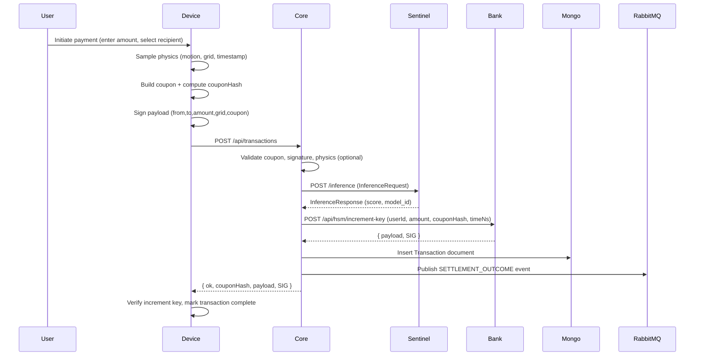
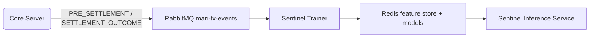
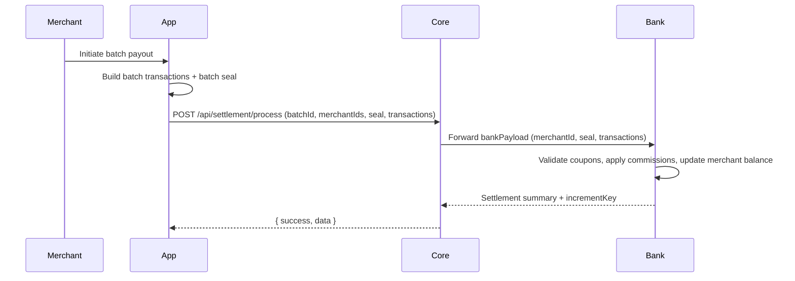

# End-to-End Data Flow & Lineage

## Scope

- **Goal**
  - Show how data moves from device → core → Sentinel → bank → storage.
  - Highlight how to trace a single transaction across systems.

## High-Level Transaction Flow (Online Payment)

## Detailed Flow by Stage

### 1. Device: Data Creation

- **Inputs**
  - User intent: amount, recipient.
  - Physics: motion vector, location grid, timestamps.
- **Processing**
  - Construct coupon URL with fields: `from`, `to`, `val`, `g`, `exp`, `s`.
  - Compute `couponHash = sha256(coupon)`.
  - Canonicalize `{ from, to, amount, grid, coupon }`.
  - Sign canonical payload with device private key → `sig`.
- **Outputs to Core**
  - JSON body with:
    - `from`, `to`, `grid`, `amount`, `coupon`, `kid`, `sig`, `physicsData`.

### 2. Core: Ingestion & Normalization

- **Input**
  - HTTP request body from device.
- **Steps**
  - Normalize field names (support legacy and new shapes).
  - Recompute `couponHash = sha256(coupon)`.
  - Check in-process idempotency (reject duplicates within process lifetime).
  - If `kid` & `sig` present:
    - Look up SPKI via `deviceRegistry`.
    - Verify signature against canonical payload.
  - If `physicsData` present:
    - Build `currentPhysics` snapshot.
    - Call `PhysicsValidationService.validateTransaction`.
- **Possible Outcomes**
  - Early reject with structured error:
    - Signature invalid.
    - Missing required fields.
    - Physics invalid.
    - Coupon URL invalid.
  - Proceed to risk evaluation.

### 3. Core → Sentinel: Risk Evaluation

- **Input to Sentinel**
  - `InferenceRequest`:
    - `coupon_hash`, `kid`, `expiry_ts`, `seal`, `grid_id`, `amount`.
- **Internal Sentinel Steps**
  - Convert request to numeric feature vector via `featurizer`.
  - Run model (RandomForest ONNX) using features.
  - Produce `score` and attach current `model_id`.
- **Output to Core**
  - `InferenceResponse`:
    - `score` (0–999).
    - `model_id`.

- **Core Decision Based on Sentinel**
  - If Sentinel unreachable and fail-close mode:
    - Reject as `sentinel_unavailable`.
  - If `score > SENTINEL_THRESHOLD`:
    - Reject as `high_risk_transaction` with `score` and `modelId`.
  - Else:
    - Proceed to HSM settlement.

### 4. Core → Bank: Settlement & Increment Key

- **Input to Bank HSM**
  - HTTP JSON payload:
    - `userId`: sender bio hash or mapped user ID.
    - `amount`.
    - `couponHash`.
    - `timeNs`: current time in nanoseconds.
- **Bank Processing**
  - Derive or confirm sender account from `userId`.
  - Update ledger balances (reserve transfer logic).
  - Increment per-user `VERSION` counter.
  - Build increment key payload:
    - `USER_ID`, `AMOUNT`, `COUPON_HASH`, `TIME_NS`, `VERSION`, `HSM_KID`.
  - Sign canonical JSON with HSM RSA private key → `SIG`.
- **Output to Core**
  - JSON `{ payload, SIG }`.

### 5. Core: Persistence & Label Publishing

- **Mongo Transaction Insert**
  - Build document with:
    - `transactionId`, `senderBioHash`, `receiverBioHash`, `amount`, `locationGrid`, `coupon`.
    - Optional `physicsData` snapshot.
    - `transportMethod: 'HTTP'` (or `'SMS'` for SMS-triggered path).
    - `status: 'SETTLED'` if `payload && SIG`, else `'FAILED'`.
  - Insert into `transactions` collection.

- **Label Event Emission**
  - Build `TransactionEvent` for `SETTLEMENT_OUTCOME`:
    - `event_id`, `event_type`, `coupon_hash`, `kid`, `expiry_ts`, `seal`, `grid_id`, `amount`, `result`.
  - Always log to stdout.
  - If `RABBITMQ_URL` configured and reachable:
    - Publish to `mari-tx-events` queue.

### 6. Trainer: Label Joins & Model Updates

- **PRE_SETTLEMENT Events**
  - Stored in-memory by trainer keyed on `coupon_hash`.
- **SETTLEMENT_OUTCOME Events**
  - If `result` present, joined with corresponding `PRE_SETTLEMENT`.
  - Both are featurized; label derived from `result`.
- **Model Training**
  - Batches of `{ x: features, y: label }` are trained into new models.
  - New models are stored in Redis and hot-swapped into inference.

## Batch Settlement Flow (Merchant)

- **Data Characteristics**
  - Batch-level aggregation over many coupons.
  - Per-transaction statuses in response.
  - Increment key summarizing merchant balance state.

## Lineage & How to Trace a Transaction

- **Start From Coupon or Hash**
  - Known coupon string → compute `couponHash`.
  - Use `couponHash` to query:
    - Mongo `transactions` collection (by `coupon` or by precomputed hash index if present).
    - Sentinel logs and metrics.
    - `TransactionEvent` stream archives.

- **Join Across Systems**
  - **Mongo ↔ Sentinel**
    - Key: `couponHash` / `coupon_hash`.
  - **Mongo ↔ Bank**
    - Keys: `couponHash`, `USER_ID` (sender), amounts and times.
  - **Events ↔ Inference**
    - Keys: `coupon_hash`, `kid`, `grid_id`, `expiry_ts`, `amount`.

- **Example Forensic Workflow**
  - Given suspicious transaction:
    - Locate Mongo record by `transactionId`.
    - Derive or compute `couponHash`.
    - Pull Sentinel score and model ID via logs or model metrics.
    - Pull `TransactionEvent` pair from event store.
    - Verify increment key payload and signature from bank logs.
    - Recreate feature vector to understand why Sentinel scored as it did.
