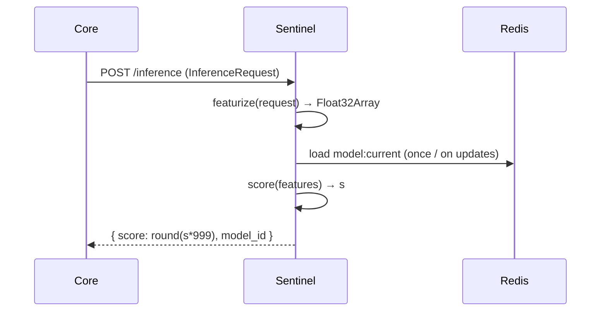
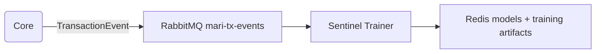

# Sentinel Risk & Training Data

## Scope

- **Goal**
  - Describe how Sentinel evaluates risk and how training data is produced.
  - Explain the feature space, labels, and continuous learning loop.

## Inference Request & Response

- **InferenceRequest (Core → Sentinel)**
  - Fields:
    - `coupon_hash: string` (64-hex).
    - `kid: string` (device key ID).
    - `expiry_ts: number` (ms since epoch).
    - `seal: string` (8-hex motion code).
    - `grid_id: string` (location grid).
    - `amount: number`.

- **InferenceResponse (Sentinel → Core)**
  - Fields:
    - `score: number` (0–999 integer).
    - `model_id: string`.

## Feature Engineering

- **Featurizer Output (Float32Array of length 8)**
  - `kid_hash`
    - `hashCode(kid) % 10000`.
    - Encodes device identity without exposing raw `kid`.
  - `seal_hash`
    - `hashCode(seal) % 10000`.
    - Reflects motion pattern; constant seals indicate bots.
  - `grid_hash`
    - `hashCode(grid_id) % 1000`.
    - Coarse encoding of location.
  - `amount`
    - Raw numeric amount.
  - `time_to_expiry`
    - `expiry_ts - now`.
    - Short windows can indicate rushed or scripted transactions.
  - `hash_seen`
    - Currently `0` in code path (reserved for future replay counts).
  - `coupon_prefix`
    - `parseInt(coupon_hash.slice(0, 2), 16)`.
  - `coupon_suffix`
    - `parseInt(coupon_hash.slice(-2), 16)`.

## Model & Scoring

- **Model Architecture**
  - RandomForest classifier exported to ONNX.
  - Runs inside Sentinel inference service using ONNX Runtime.

- **Score Semantics**
  - Raw model output `s` in `[0,1]`.
  - Transformed to integer `score = round(s * 999)`.
  - Intended interpretation:
    - Higher score → higher fraud risk.

- **Decision Thresholds (Core Configuration)**
  - `SENTINEL_THRESHOLD` (e.g. `850`).
  - Policy:
    - `score > threshold` → reject with `high_risk_transaction`.
    - `score <= threshold` → proceed to HSM.

## Inference Path Data Flow



## Label Events & Training Data

- **TransactionEvent Schema**
  - `event_id: string`.
  - `event_type: 'PRE_SETTLEMENT' | 'SETTLEMENT_OUTCOME'`.
  - `coupon_hash: string`.
  - `kid: string`.
  - `expiry_ts: number`.
  - `seal: string`.
  - `grid_id: string`.
  - `amount: number`.
  - `result?: 'SUCCESS' | 'DUPLICATE' | 'INVALID_SIG' | 'ERROR'`.

- **Event Flow**



- **Trainer Logic (Dataset)**
  - On `PRE_SETTLEMENT`:
    - Store event in-memory keyed by `coupon_hash`.
  - On `SETTLEMENT_OUTCOME` with `result`:
    - Retrieve stored `PRE_SETTLEMENT` event.
    - Featurize it (same pipeline as inference).
    - Label:
      - `y = 1` for `result === 'SUCCESS'`.
      - `y = 0` for other results.
    - Append `{ x: features, y }` to training dataset.

## Training & Model Deployment

```mermaid
flowchart LR
  Subgraph1[Trainer] -->|batches of (x,y)| ModelBuilder[Model Builder]
  ModelBuilder -->|ONNX model + metadata| Redis
  Redis --> Inference[Inference Service]
  Redis --> PubSub[model-updates channel]
  PubSub --> Inference
```

- **Training Steps**
  - Accumulate labeled examples into batches.
  - Train new models offline or online (implementation-specific).
  - Serialize models to ONNX and store in Redis under `model:<id>`.
  - Update `model:current` key with `{ model_id, buffer }`.

- **Hot-Swap Mechanism**
  - Inference service:
    - On startup: reads `model:current` from Redis.
    - Subscribes to `model-updates` channel.
    - On update:
      - Loads `model:<newId>` from Redis.
      - Replaces in-memory model.
      - Updates Prometheus `model_version_info`.

## Analytical Questions Supported

- **Per-Transaction Analysis**
  - Given `coupon_hash`:
    - Find `InferenceRequest` features (reconstruct from event fields).
    - Retrieve Sentinel score and model ID.
    - Inspect `TransactionEvent` pair (`PRE_SETTLEMENT`, `SETTLEMENT_OUTCOME`).

- **Model Behavior Over Time**
  - Track distribution of scores:
    - Per user, per device, per grid.
  - Correlate score with `result` labels.
  - Monitor impact of model updates (`model_id` changes).

- **Feature Importance & Design**
  - Investigate how:
    - `seal_hash` and `grid_hash` correlate with fraud.
    - `time_to_expiry` and `amount` affect risk.
  - Propose new features (e.g. historical frequency of `coupon_hash` or `kid`).

## Limitations & Considerations

- **Feature Space Size**
  - 8 numeric features: intentionally compact.
  - Analysts should consider whether more features are needed for desired detection power.

- **Label Quality**
  - Labels depend on `result` classification logic.
  - Misclassification of `SUCCESS` vs non-success will directly affect model behavior.

- **Data Latency**
  - Training data depends on both `PRE_SETTLEMENT` and `SETTLEMENT_OUTCOME` events.
  - Delays in outcome events delay learning about fraud patterns.
