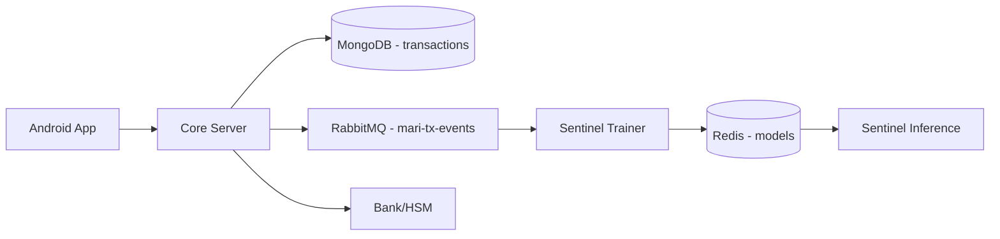

# Storage, Retention & Privacy

## Scope

- **Goal**
  - Enumerate where data is stored, for how long, and at what level of identifiability.
  - Highlight privacy and access considerations for analysts.

## Data Stores Overview

- **MongoDB (Core)**
  - Stores transaction records.
  - Primary use for audit, reporting, and reconciliation.

- **Redis (Sentinel)**
  - Stores models and potentially training artifacts.
  - Used for fast read access by inference and trainer.

- **RabbitMQ (Event Bus)**
  - Stores `TransactionEvent` messages in `mari-tx-events` queue.
  - Acts as a buffer between core and trainer.

- **Filesystem / Logs**
  - Application logs from core, sentinel, trainer, bank.
  - Container logs visible via Docker.

## Database Architecture Overview

- **MongoDB**
  - Central store for transaction-level records.
  - Used by analysts for most quantitative and forensic work.
- **RabbitMQ**
  - Short-lived event buffer for `TransactionEvent` between Core and Trainer.
  - Feeds the training pipeline; may be mirrored to long-term stores for analysis.
- **Redis**
  - Stores current and historical ML models.
  - Indirectly influences risk decisions but does not hold raw transaction data.
- **Bank / HSM**
  - Holds balances of record and increment key data.
  - Typically accessed through separate banking systems for financial reporting.

## MongoDB: Transaction Records

- **Collection:** `transactions`
- **Key Fields for Privacy**
  - `senderBioHash`, `receiverBioHash`:
    - Pseudonymous identifiers for people.
    - No raw PII (names, phone numbers) stored.
  - `locationGrid`:
    - Coarse geospatial cell, not raw GPS coordinates.
  - `coupon`:
    - Contains encoded intent and physics-related fields.
    - Analysts should treat coupons as sensitive because they link multiple dimensions.

- **Retention Considerations**
  - Default behavior in code: no automatic TTL.
  - Policy decisions (external to code) should define:
    - How long completed transactions are retained.
    - Whether older records are archived, anonymized, or deleted.

## Redis: Models & Training Artifacts

- **Keys**
  - `model:current`:
    - JSON: `{ model_id, buffer }` where `buffer` is base64-encoded ONNX.
  - `model:<id>`:
    - Persisted models.

- **Data Characteristics**
  - No PII or per-transaction data stored.
  - Contains only model parameters and metadata.

- **Retention Considerations**
  - Old model versions may be kept for:
    - Regression testing.
    - Incident review.
  - Policies should define how many versions to retain.

## RabbitMQ: Event Stream

- **Queue:** `mari-tx-events`
- **Message Schema:** `TransactionEvent`
  - Contains pseudonymous identifiers and risk features.

- **Queue Configuration**
  - `x-message-ttl`: 86,400,000 ms (24 hours).
  - `x-max-length`: 1,000,000 messages.

- **Implications**
  - Events are transient by default; trainer consumes them.
  - For deeper forensic work, analysts may want:
    - Additional durable sinks (e.g. data warehouse) where events are mirrored.

## Logs & Metrics

- **Core Logs**
  - Contain:
    - Structured error messages.
    - Sentinel decision metadata (score, modelId) when logged.
    - LabelPublisher logs with serialized `TransactionEvent`.

- **Sentinel Logs & Metrics**
  - Metrics:
    - Request counts, latency, score distributions, model version info.
  - Logs:
    - Model load events, hot-swap events, inference failures.

- **Bank & Trainer Logs**
  - Bank:
    - Settlement requests and internal failures.
  - Trainer:
    - Event consumption status, Redis/RabbitMQ readiness.

## Identifiability Levels

- **Direct Identifiers (Not Stored)**
  - Names, phone numbers, raw GPS coordinates.

- **Pseudonymous Identifiers**
  - `senderBioHash`, `receiverBioHash`.
  - `kid` (device key ID).
  - `USER_ID` in increment keys.

- **Quasi-Identifiers**
  - `locationGrid` / `grid_id`.
  - Time fields (timestamps, expiry).
  - Amounts and transaction patterns.

- **Derived Features**
  - Hashed IDs and seals in Sentinel feature space.
  - Harder to trace back directly, but still meaningful for pattern analysis.

## Access Considerations for Analysts

- **Recommended Access Model**
  - Read-only access to:
    - MongoDB (production replica or anonymized export).
    - Event sinks or derived datasets.
    - Metrics endpoints or time-series database.
  - No direct write access to:
    - Production Redis or RabbitMQ.
    - Bank ledger state.

- **Data Minimization Practices**
  - Prefer aggregated views for routine analysis.
  - Use per-transaction traces only for targeted investigations.

## Forensic Workflow Examples

- **Investigate Suspicious Pattern**
  - Step 1:
    - Query Mongo for transactions matching pattern (e.g. grid, amount range, time window).
  - Step 2:
    - Join with Sentinel scores and labels via `couponHash`.
  - Step 3:
    - Review any related batch settlement summaries.

- **Model Audit After Incident**
  - Step 1:
    - Identify affected transactions and `couponHash` set.
  - Step 2:
    - Reconstruct feature vectors and scores using archived data.
  - Step 3:
    - Compare scores across model versions using `model_id`.
