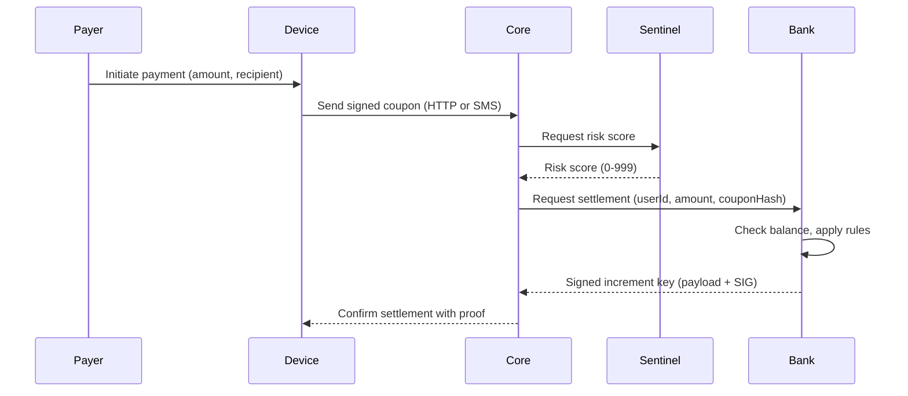

# Mari Economic Model & Value Proposition

## Scope

- **Audience**
  - Finance, accounting, treasury, and strategy teams.
- **Goal**
  - Describe how value moves in Mari.
  - Explain who holds balances and where revenue comes from.
  - Provide a clear mental model without implementation details.

## What Mari Is (Financial View)

- **Digital payment rail**
  - Enables person-to-person and merchant payments using signed digital coupons.
  - Couples each payment with rich context (device, location grid, motion, risk score).
- **Who holds value**
  - The **bank / HSM service** maintains the authoritative balance ledger.
  - Mari Core orchestrates payments, performs risk checks, and records detailed journals.
- **Instrument characteristics**
  - Each payment is a one-off **transfer of value**, not a credit line or loan.
  - No penalties, interest, or revolving balances implemented in the system.

## Target Market (Finance View)

- **Primary Environments**
  - Regions where:
    - Data connectivity can be intermittent or expensive.
    - SMS is widely available and reliable.
    - Android devices are common among end users.

- **Primary Use Cases**
  - Person-to-person payments (remittances, informal transfers).
  - Small merchant payments (shops, markets, micro-merchants).
  - Field payouts (payroll, stipends, social/aid disbursements).

- **Financial Implications**
  - Commission and volume profiles may differ by segment:
    - High-volume, low-ticket consumer payments.
    - Merchant settlement flows with batch commissions.
    - Institutional or NGO-style payout campaigns.

## Actors & Financial Roles

- **End User (Payer / Payee)**
  - Has a bank-side account represented by a pseudonymous identifier (bio hash / user ID).
  - Balance lives in the **bank ledger**, not on-device.

- **Merchant / Business**
  - Has a dedicated **merchant account** in the bank ledger.
  - Receives net settlement amounts after commissions are applied.

- **Mari Core**
  - Orchestrates payment flow and risk checks.
  - Maintains **transaction journal** (Mongo) but not the primary balance ledger.
  - Emits events with decisions and results for analytics.

- **Bank + HSM**
  - Maintains authoritative balances per user and merchant.
  - Applies commissions and updates reserves.
  - Issues **signed proofs of settlement** (increment keys and batch increment keys).

## Value Flow (Single Payment)

- **Financial meaning**
  - If risk is acceptable and balance sufficient:
    - Payer balance decreases by `amount`.
    - Receiver/merchant balance increases (immediately or via batch settlement).
  - Every successful payment has a signed receipt from the bank HSM.

## Revenue Model (High-Level)

- **Commission-based**
  - The bank settlement layer applies two commission components per transaction:
    - **Protocol commission** (protocol revenue).
    - **Bank commission** (bank revenue).
  - Commissions are percentages of the **transaction amount**.

- **Where commissions are computed**
  - In the **bank settlement service** during processing of:
    - Individual transactions (per transfer).
    - Batch merchant settlements.

- **Net flows**
  - For a merchant batch:
    - `netAmount = amount - protocolCommission - bankCommission` per transaction.
    - Merchant receives sum of all `netAmount`.
    - Protocol and bank keep their respective commission totals.

## Transport & Connectivity (Economic Impact)

- **HTTP rail**
  - Online payments over HTTPS.
  - Supports low-latency, high-volume transactions.
- **SMS rail**
  - Offline / low-connectivity fallback.
  - Allows value movement in environments with poor data coverage.
- **Common economic behavior**
  - Regardless of rail:
    - Same risk evaluation.
    - Same settlement rules.
    - Same commission logic.

## Economic Guarantees & Non-Goals

- **Guarantees (System Design)**
  - Every accepted payment is accompanied by:
    - A firm balance update in the bank ledger.
    - A signed increment key that can be independently verified.
  - Core’s transaction records and events provide a **detailed audit trail** but do not replace the bank ledger.

- **Non-Goals (Important for Finance)**
  - No built-in credit or lending product.
  - No penalties or punitive financial mechanics implemented.
  - No interest calculation logic in the codebase.

## How Finance Can Use This Model

- **Treasury & Liquidity**
  - Size funding for user and merchant accounts based on observed flow.
  - Use commissions and volumes to project protocol and bank revenue.

- **Product & Pricing**
  - Adjust commission rates externally to support:
    - Different markets.
    - Different merchant categories.

- **Risk-Adjusted Value**
  - Combine risk scores and settlement outcomes to understand:
    - Fraud-adjusted yield of flows.
    - Performance of commission levels vs fraud losses.
