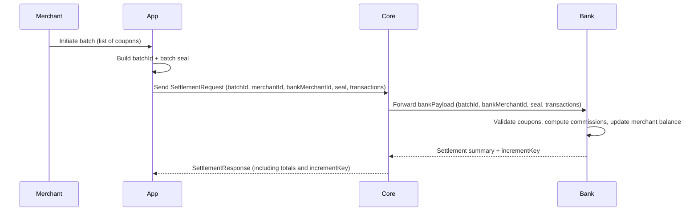

# Settlement Lifecycle & Ledgers

## Scope

- **Audience**
  - Finance, accounting, and operations teams.
- **Goal**
  - Describe how and when money actually moves.
  - Clarify the structure of user and merchant ledgers.
  - Explain how cryptographic receipts (increment keys) relate to balances.

## Types of Settlement

- **Immediate settlement (single payment)**
  - Used for most consumer payments.
  - Settlement is requested from the bank immediately after risk approval.

- **Batch settlement (merchant)**
  - Used to aggregate many coupons into a single merchant payout.
  - Settlement is requested periodically (e.g. end of day) for a batch.

## User Ledger (Per-Payer)

- **Account representation**
  - Each user has a bank-side account keyed by a stable identifier.
  - Payer account is debited when a payment is accepted.

- **Immediate settlement lifecycle**
  - Step 1: Core risk-approves the payment.
  - Step 2: Core calls bank with `{ userId, amount, couponHash, timeNs }`.
  - Step 3: Bank:
    - Retrieves last `VERSION` for that user.
    - Verifies that user has sufficient funds (implementation detail).
    - Increments `VERSION` by 1.
    - Updates balance.
    - Constructs increment key payload:
      - `USER_ID`, `AMOUNT`, `COUPON_HASH`, `TIME_NS`, `VERSION`, `HSM_KID`.
    - Signs payload with HSM private key → `SIG`.
  - Step 4: Core returns `{ payload, SIG }` to client.

- **Financial interpretation**
  - Each increment key represents **one step** in the ledger for that user.
  - The sequence of increment keys (ordered by `VERSION`) forms the **transaction history** for that user.

## Merchant Ledger & Batch Settlement

- **Merchant accounts**
  - Bank maintains merchant accounts keyed by `merchantId`.
  - These accounts receive net amounts from batch settlement.

- **Batch settlement lifecycle**



- **Per-transaction processing inside batch**
  - For each coupon in the batch:
    - Validate coupon structure.
    - Confirm coupon amount matches provided amount.
    - Compute commissions:
      - `protocolCommission = amount * protocolRate`.
      - `bankCommission = amount * bankRate`.
      - `netAmount = amount - protocolCommission - bankCommission`.
    - Transfer `netAmount` from sender’s reserve to merchant account.
  - Aggregate:
    - `totalAmount = sum(netAmount)`.
    - `totalCommission = sum(protocolCommission + bankCommission)`.

- **Batch increment key**
  - After processing all transactions:
    - Bank creates a separate increment key summarizing the merchant’s updated balance.
    - Returned as part of `SettlementResponse`.

## Ledgers vs Transaction Journal

- **Bank ledger (authoritative)**
  - Maintains final balances for all users and merchants.
  - Updated by settlement operations only.
  - Backed by HSM signatures.

- **Core transaction journal (Mongo)**
  - Records **attempts and outcomes** for each transaction.
  - Fields include:
    - `senderBioHash`, `receiverBioHash`, `amount`, `locationGrid`, `coupon`.
    - `transportMethod` (HTTP/SMS), `physicsData` (optional).
    - `status`: PENDING, SETTLED, FAILED.
  - Purpose:
    - Analytics, audit trails, operational debugging.

## Timeline of a Single Settled Payment

```mermaid
graph TD
  A[Intent captured on device] --> B[Risk & physics checks in Core]
  B --> C[Sentinel risk score]
  C -->|Approved| D[Bank settlement request]
  D --> E[Ledger update & increment key issuance]
  E --> F[Core records SETTLED transaction]
  F --> G[Training event (SETTLEMENT_OUTCOME)]
```

- **Key timestamps**
  - Device intent time (physicsData timestamp).
  - Core receipt time.
  - Bank settlement time (TIME_NS in increment key).
  - DB `createdAt` and `updatedAt`.

## Failure Scenarios (Settlement Perspective)

- **Risk rejection**
  - Settlement not requested.
  - Transaction recorded with status `FAILED` (or not persisted, depending on configuration).

- **Bank-side failure**
  - Example causes:
    - Insufficient funds.
    - Internal bank error.
  - Outcome:
    - No ledger update.
    - Core marks transaction as `FAILED`.

- **Batch validation failure**
  - Invalid batch seal or malformed coupons.
  - Entire batch rejected; no merchant ledger changes.

## What Accounting Should Take Away

- **Balances of record**
  - Use **bank ledger state** (and its increment keys) as the canonical source for balances.
  - Core’s `transactions` collection is a supporting journal.

- **Revenue recognition**
  - Commissions are recognized:
    - When settlement occurs at the bank layer.
  - For a batch:
    - Protocol and bank commissions can be summed from the settlement response.

- **Audit & Controls**
  - Increment key sequences per user and per merchant offer a cryptographic proof of:
    - Every state change in their ledger accounts.
  - Core journals and event streams provide additional context for each step.
