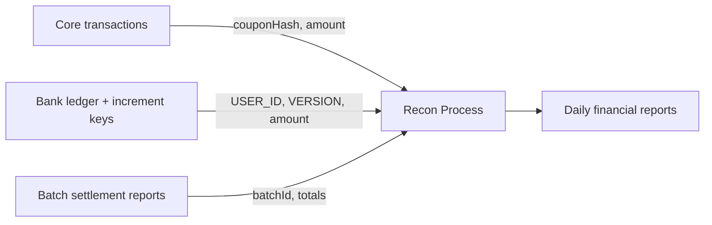

# Reconciliation & Financial Reporting

## Scope

- **Audience**
  - Accounting, finance operations, internal audit.
- **Goal**
  - Show how to reconcile Mari data with the bank ledger and external statements.
  - Outline key identifiers and views for financial reporting.

## Key Data Sources

- **Bank Ledger & Increment Keys**
  - Authoritative account balances for users and merchants.
  - Increment keys (per user and per batch) encode:
    - User/merchant identifiers.
    - Amounts and versions.
    - Timestamps.

- **Core Transaction Journal (Mongo)**
  - Detailed record of each payment attempt and outcome.
  - Contains:
    - Parties (pseudonymous IDs), amount, status, timestamps.
    - Transport method (HTTP/SMS) and optional physics.

- **Settlement Responses (Batch)**
  - Per-batch details for merchants:
    - `batchId`, `processed`, `successful`, `failed`.
    - `totalAmount`, `totalCommission`.
    - `incrementKey` summarizing merchant balance.

- **Event Streams (Training & Audit)**
  - `TransactionEvent` from core via `mari-tx-events` queue.
  - Provide an independent record of decisions (PRE_SETTLEMENT vs SETTLEMENT_OUTCOME).

## Core Identifiers for Reconciliation

- **Per-Transaction**
  - `couponHash` / `coupon_hash`.
  - `transactionId` (core journal).
  - `USER_ID` in increment keys.

- **Per-Batch**
  - `batchId` (in app, core, and bank responses).
  - Merchant identifiers:
    - `merchantId` (core-side).
    - `bankMerchantId` (bank-side).

- **Per-Account**
  - Bank account IDs for users and merchants.
  - Monotonic `VERSION` fields from increment keys.

## Daily Reconciliation Workflow (Example)

- **Step 1: Extract core transactions**
  - Filter by date range (e.g. UTC day).
  - Include fields:
    - `transactionId`, `coupon`, `senderBioHash`, `receiverBioHash`, `amount`, `status`, `transportMethod`, timestamps.

- **Step 2: Extract bank ledger movements**
  - For the same period, pull:
    - Increment keys (per user and per batch).
    - Account balances at start and end of day.

- **Step 3: Match by identifiers**
  - Join core transactions with bank movements using:
    - `couponHash` ↔ `COUPON_HASH`.
    - `senderBioHash` ↔ `USER_ID` mapping.
  - For batch settlements:
    - Use `batchId` and merchant IDs.

- **Step 4: Resolve differences**
  - Investigate:
    - Transactions with `SETTLED` in core but missing ledger movement.
    - Ledger movements without corresponding core transaction (should be rare).
  - Use logs and events as secondary evidence.

## Merchant Settlement Reporting

- **Data needed per merchant**
  - Batches settled in the period.
  - For each batch:
    - `batchId`.
    - `processed`, `successful`, `failed` counts.
    - `totalAmount` (net received).
    - `totalCommission`.

- **Reporting metrics**
  - Per merchant, per period:
    - Gross volume (sum of underlying amounts).
    - Net volume (sum of net credited amounts).
    - Protocol commission revenue.
    - Bank commission revenue.

- **Use cases**
  - Merchant statements.
  - Revenue share calculations.
  - Internal revenue recognition.

## Risk-Adjusted Financial Views

- **Combining financial and risk data**
  - Link each settled transaction to:
    - Sentinel score and model ID.
    - Settlement outcome (`SUCCESS` vs failure types).
  - Produce reports such as:
    - Volume and revenue by risk band.
    - Charge-off / fraud write-off estimates per band.

- **Benefits**
  - Enables pricing and limit decisions based on data.
  - Supports answering "What is the yield of this rail after fraud?".

## Example Reports

- **Daily Volume & Revenue Report**
  - Columns:
    - Date, total number of transactions, total settled volume.
    - Total protocol commissions, total bank commissions.

- **Merchant Payout Report**
  - Columns:
    - Merchant ID, number of batches, gross volume, net volume, commissions, payouts.

- **Risk Band Profitability Report**
  - Columns:
    - Risk bucket (based on Sentinel score).
    - Volume, commission revenue, estimated fraud losses.

## Practical Notes

- **Time zones & cutoffs**
  - Define a canonical reporting timezone (e.g. UTC) for daily cutoffs.

- **Currency handling**
  - Current code treats `amount` as a numeric field.
  - Accounting policy should define:
    - Currency unit per environment.
    - FX handling if multiple currencies are introduced.

- **Data access**
  - For production, prefer read-only replicas or export pipelines.
  - Avoid direct writes to production ledgers from reporting processes.
