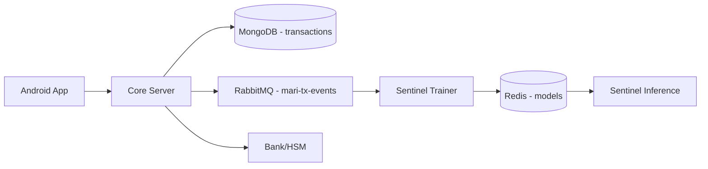

# Database & Infrastructure Security

## Scope

- **Audience**
  - Security engineers, infra/security ops.
- **Goal**
  - Describe how data stores and services fit into the security model.
  - Outline recommended hardening for MongoDB, Redis, RabbitMQ, and service-to-service access.

## Data Stores & Security Roles

- **MongoDB (Core)**
  - Stores transaction journals (no balances of record).
  - Contains pseudonymous identifiers, coupons, and optional physics snapshots.

- **Redis (Sentinel)**
  - Stores ML models and potentially training artifacts.
  - Does not store raw transaction logs.

- **RabbitMQ (Event Bus)**
  - Transports `TransactionEvent` messages between Core and Trainer.
  - Acts as a short-lived buffer (24h TTL in demo).

- **Bank / HSM Storage**
  - Stores account states and HSM keys.
  - Authoritative for balances and settlement proofs.

## Database Architecture (Security View)

- **Core ↔ Mongo**
  - Writes: transaction documents with status and payload.
  - Reads: for audit and reporting.

- **Core ↔ MQ ↔ Trainer ↔ Redis ↔ Inference**
  - Event-based pipeline for risk model updates.
  - Redis acts as central store for current model and versions.

- **Core ↔ Bank**
  - HTTP requests for settlement; bank responds with increment keys.

## Database Security Considerations

- **MongoDB**
  - Recommended:
    - Enable authentication and TLS.
    - Restrict network access to Core and admin hosts only.
    - Use role-based access control (RBAC) to limit operations (e.g. read-only replicas for analytics).
    - Monitor for anomalous queries and access patterns.

- **Redis**
  - Recommended:
    - Run in a private network segment with no public exposure.
    - Require authentication for clients.
    - Use TLS or an encrypted tunnel for inter-service connections.
    - Separate Redis instances or namespaces for models vs other data.

- **RabbitMQ**
  - Recommended:
    - Use virtual hosts and user accounts with least privilege.
    - Enable TLS for connections.
    - Restrict the `mari-tx-events` queue to Core and Trainer services.

- **Bank / HSM**
  - Recommended:
    - Treat HSM key material as the highest sensitivity.
    - Use hardware-backed HSM or cloud KMS in production.
    - Isolate bank/HSM network from general application network.
    - Log and monitor all settlement requests and key operations.

## Service-to-Service Security

- **Mutual Authentication**
  - Between Core and Sentinel:
    - Use auth tokens (already supported via `SENTINEL_AUTH_TOKEN`).
    - Consider mTLS for stronger guarantees.
  - Between Core and Bank/HSM:
    - Use mTLS and IP allow-lists.

- **Authorization**
  - Limit which paths and methods services can call.
  - Separate credentials per environment (dev, staging, prod).

- **Network Segmentation**
  - Place databases and message brokers on non-public networks.
  - Expose only necessary ports via load balancers or API gateways.

## Logging & Secrets Management

- **Logging**
  - Avoid logging sensitive fields (full coupons, raw physics), or redact where needed.
  - Centralize logs for security monitoring and incident response.

- **Secrets**
  - Store credentials and tokens in a dedicated secrets manager.
  - Rotate secrets regularly.
  - Avoid embedding secrets in images, code, or public configs.

## Hardening Priorities (Checklist)

- **1. Access Control**
  - [ ] MongoDB auth + TLS, network-restricted.
  - [ ] Redis auth, private network only.
  - [ ] RabbitMQ users and vhosts with minimal permissions.

- **2. Transport Security**
  - [ ] TLS everywhere external to a trust boundary.
  - [ ] Consider mTLS for inter-service communication in production.

- **3. Key & Secret Management**
  - [ ] HSM keys in proper HSM/KMS.
  - [ ] Application secrets in central secret store.

- **4. Monitoring & Alerts**
  - [ ] Metrics and logs exported to SIEM or observability stack.
  - [ ] Alerts on anomalous access, failed auth attempts, unusual traffic.

## Relation to Data Analyst Views

- **Same stores, different focus**
  - Analysts see Mongo, Redis, RabbitMQ as data sources.
  - Security sees them as trust boundaries and assets to protect.

- **Documents for Analysts**
  - Data-analyst docs already describe:
    - Which data lives in each store.
    - How long it is retained.
    - How it can be accessed for analysis.
