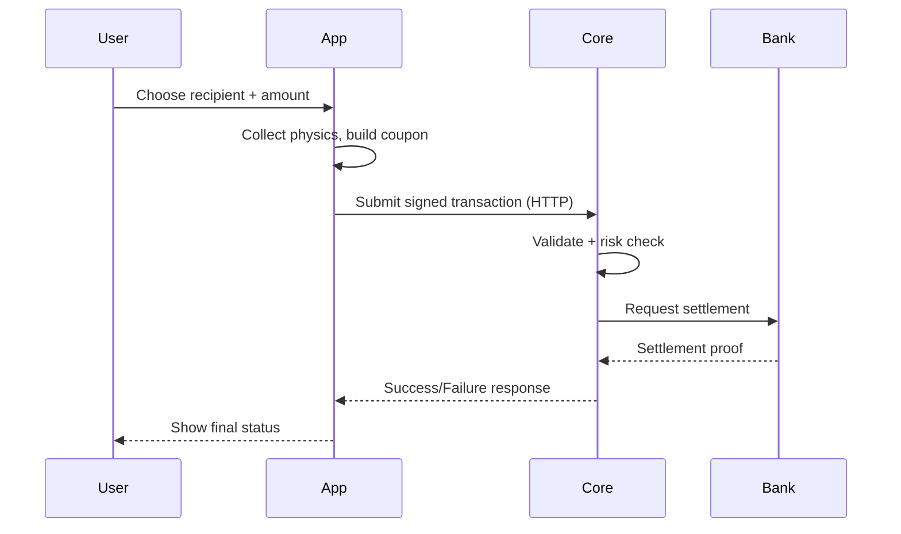
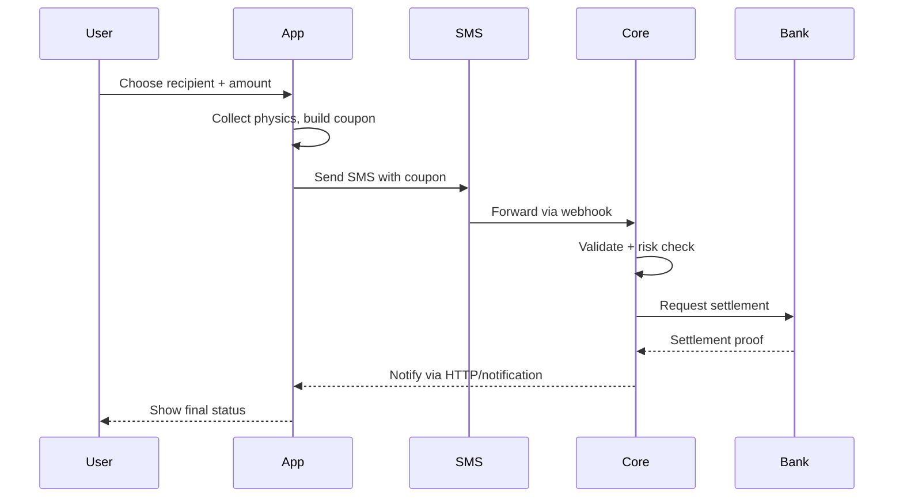

# Core User Flows & Interactions

## Scope

- **Audience**
  - UX designers, product managers, user research.
- **Goal**
  - Describe the main user flows in Mari.
  - Highlight UX-sensitive states: loading, errors, offline.

## High-Level Flows

- **Onboarding / Device Setup**
  - User installs app.
  - App generates a device keypair and registers `kid` with Core.
  - Optional: user binds a profile (name, photo) on top of internal bio hash.

- **Send Payment (Online HTTP)**
  - User chooses recipient (contact, QR, short code).
  - User enters amount.
  - App collects physics snapshot (motion, grid, time) in background.
  - App constructs coupon and signs it.
  - App calls HTTP endpoint to submit transaction.
  - App shows progress states:
    - "Sending" → "Checking" (risk/settlement) → "Success" or "Failed".

- **Send Payment (SMS Fallback)**
  - User chooses recipient and amount as usual.
  - App detects that HTTP route is unavailable or poor.
  - App constructs same coupon and encodes into SMS.
  - App sends SMS to a preconfigured gateway number.
  - App may:
    - Show local "Sent via SMS" state.
    - Receive push/HTTP response later confirming settlement.

- **Receive Payment**
  - In most designs, receiver:
    - Shows a QR code or identifier.
    - Or is selected from contacts.
  - Receiver sees:
    - Notification of incoming payment once settled.
    - In some flows, a "pending" view while sender is still acting.

- **View History**
  - Users can view a list of:
    - Completed payments.
    - Failed attempts.
  - Key UX elements:
    - Clear indication of status (success/failed).
    - Timestamps and counterparties.
    - Optionally, basic risk info (e.g. "flagged" vs "normal").

## Detailed Flow: Send Payment (HTTP)

- **User-visible states**
  - Idle → Entering details → Sending → Checking → Settled / Failed.

## Detailed Flow: Send Payment (SMS)

- **UX implications**
  - Delay between user sending SMS and receiving final confirmation.
  - Need clear messaging: "Sent via SMS, awaiting confirmation".

## Errors & Edge Cases

- **Common error types (user-facing)**
  - Network / connectivity errors.
  - Insufficient funds (bank-side).
  - Risk rejection (high risk transaction).
  - Expired coupon.

- **UX guidelines**
  - Messages must:
    - Avoid technical jargon (no raw error codes).
    - Suggest next steps (retry, check connection, contact support).
    - Distinguish between "your device" issues vs "system" issues.

## Accessibility & Constraints

- **Device constraints**
  - Design for low-end Android:
    - Low memory, slower CPU.
    - Limited storage.
  - Keep flows responsive with background work for physics and risk.

- **Connectivity constraints**
  - Assume:
    - Intermittent data.
    - SMS may be delayed.
  - Flows should:
    - Never trap user in a permanent loading state.
    - Always offer a clear way back to home and history.

## User Trust & Transparency Points

- **Place to explain**
  - Why app may ask for motion and location permissions.
  - What "risk check" means in simple terms.
  - That settlement is handled by a bank-like service.

- **Avoid**
  - Exposing internal jargon: "coupon", "increment key", "Sentinel".
  - Overloading the main payment screen with diagnostics.
