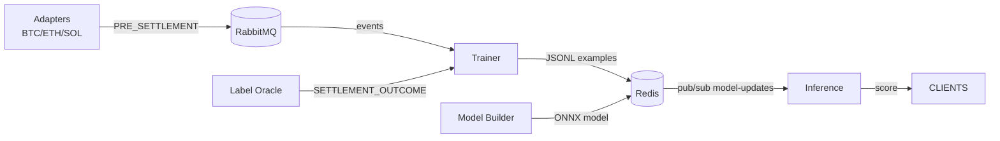

# Architecture

This document describes the internal architecture of Mari Sentinel and how the services interact.

## Data flow

## Components
- **`crypto-adapter/`**
  - Polls Bitcoin, Ethereum, Solana.
  - Publishes PRE_SETTLEMENT events to RabbitMQ.
  - Resilient serialization via BigInt-to-string conversion.
- **`label-oracle/`**
  - Produces SETTLEMENT_OUTCOME labels (mocked if credentials missing).
- **`trainer/`**
  - Temporally joins PRE and OUTCOME.
  - Buffers PRE events (TTL) and emits compact examples to Redis list `labeled:examples`.
- **`model-builder/`**
  - Offline trainer (RandomForest by default).
  - Exports ONNX via `skl2onnx` with ZipMap disabled for runtime compatibility.
  - Publishes to `model:<id>` and `model:current`, then notifies `model-updates`.
- **`inference/`**
  - Loads latest model from Redis and hot-swaps on `model-updates`.
  - Input name autodetection; robust output selection (probability tensor if available; fallback to label tensor).
  - Metrics via `prom-client` and health/readiness endpoints.
- **Monitoring**
  - Prometheus and Grafana containers with default dashboards.

## Storage & Messaging
- Redis: models, labeled examples, pub/sub channel.
- RabbitMQ: event bus for cross-service decoupling.

## Reliability patterns
- Hot-swappable models avoid downtime.
- Bounded labeled list to cap memory usage.
- Defensive JSON serialization for BigInt fields.

## Extensibility
- Plug in new adapters or label sources.
- Swap classifier for a different sklearn model or a custom ONNX.
- Replace RabbitMQ with Kafka for partitioned scalability.
