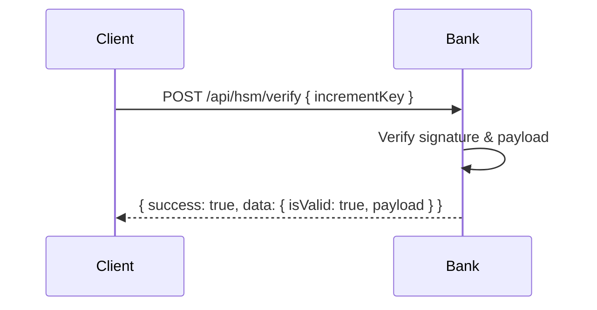

# Mari Mock Bank

A complete mock banking system implementation for the Mari protocol demonstration.

## Features

- Account management
- Reserve account system
- Settlement processing
- HSM (Hardware Security Module) simulation
- Transaction handling
- Commission calculations

## Installation

1. Clone the repository
2. Install dependencies: `npm install`
3. Copy `.env.example` to `.env` and configure
4. Start the server: `npm start`

## API Endpoints

### Accounts
- `POST /api/accounts` - Create account
- `GET /api/accounts/:id` - Get account details
- `POST /api/accounts/reserve` - Create reserve account
- `GET /api/accounts/reserve/:bioHash` - Get reserve account

### Settlement
- `POST /api/settlement/process` - Process settlement batch

### HSM
- `POST /api/hsm/increment-key` - Generate increment key
- `POST /api/hsm/verify` - Verify increment key
- `GET /api/hsm/public-key` - Get public key

### Transactions
- `GET /api/transactions/history/:accountId` - Get transaction history
- `GET /api/transactions/:transactionId` - Get transaction details

## Testing

Run tests with: `npm test`

## Docker

You can run the service fully containerized without installing Node.js locally.

### Build and Run with Docker Compose

1. Ensure your environment variables are set in `.env` at the project root (you can copy from `.env.example`).
2. Build the image and start the container:

```bash
docker compose build
docker compose up -d
```

The server will be available at http://localhost:3001

### View Logs

```bash
docker compose logs -f
```

### Stop and Remove

```bash
docker compose down
```

### Rebuild After Changes

If you change dependencies in `package.json` or code under `src/`, rebuild:

```bash
docker compose build --no-cache
docker compose up -d

## Split-up (per-service) workflow with Makefile

This project supports a split-up workflow where each service runs in its own container on a shared Docker network `mari-net`.

From `mock-bank-hsm/`:

```powershell
make net
make bank-up
make bank-logs
make bank-down
```

## End-to-end demo (copy/paste commands)

The core server will call this mock bank over HTTP. Follow these steps to run a complete demo with physics-validated transactions and settlement.

1) Start services

```powershell
Set-Location d:\mari_protocol_slim\mock-bank-hsm
make net
make bank-up
make health

Set-Location d:\mari_protocol_slim\mari-server
make mongo-up
make core-up
make health
```

2) Define helper functions in PowerShell

```powershell
function Get-MariMotionSeal([double]$x, [double]$y, [double]$z) {
  $motion = "$x,$y,$z"
  $md5 = [System.Security.Cryptography.MD5]::Create()
  $bytes = [System.Text.Encoding]::UTF8.GetBytes($motion)
  $hashBytes = $md5.ComputeHash($bytes)
  $hex = -join ($hashBytes | ForEach-Object { $_.ToString("x2") })
  $first8 = $hex.Substring(0,8)
  $intVal = [Convert]::ToInt64($first8,16)
  return ($intVal / 100000000.0)
}

function Get-BatchSeal($items) {
  $parts = @()
  foreach ($it in $items) {
    $amt = [double]$it.amount
    if ($amt -eq [math]::Truncate($amt)) { $amtStr = [int]$amt } else { $amtStr = $it.amount.ToString() }
    $parts += ($it.id + $amtStr)
  }
  $parts = $parts | Sort-Object
  $concat = ($parts -join "")
  $bytes = [System.Text.Encoding]::UTF8.GetBytes($concat)
  $sha256 = [System.Security.Cryptography.SHA256]::Create()
  $hashBytes = $sha256.ComputeHash($bytes)
  return (-join ($hashBytes | ForEach-Object { $_.ToString("x2") }))
}
```

3) Create a valid transaction via core (HTTP)

```powershell
$motionSeal = Get-MariMotionSeal -x 0.1 -y 0.2 -z 0.3

$txBody = @{
  senderBioHash = "bioSender123"
  receiverBioHash = "bioReceiver789"
  amount = 100.0
  locationGrid = "grid123"
  coupon = "mari://xfer?from=bioSender123&to=bioReceiver789&val=100&g=grid123&exp=4102444800000&s=$motionSeal"
  physicsData = @{
    location = @{ grid = "grid123" }
    motion   = @{ x = 0.1; y = 0.2; z = 0.3 }
    timestamp = "2025-01-01T00:00:00Z"
  }
} | ConvertTo-Json -Depth 5

Invoke-RestMethod -Method POST -Uri "http://localhost:3000/api/transactions" `
  -Headers @{ "Content-Type" = "application/json" } -Body $txBody
```

4) Register + login to core (JWT)

```powershell
$reg = @{
  username    = "merchant123"
  email       = "demo@mari.local"
  password    = "Passw0rd!"
  bioHash     = "bioMerchant001"
  phoneNumber = "+15555550123"
} | ConvertTo-Json

try { Invoke-RestMethod -Method POST -Uri "http://localhost:3000/api/auth/register" -Headers @{ "Content-Type"="application/json" } -Body $reg | Out-Null } catch {}

$login = @{ email="demo@mari.local"; password="Passw0rd!" } | ConvertTo-Json
$loginResp = Invoke-RestMethod -Method POST -Uri "http://localhost:3000/api/auth/login" -Headers @{ "Content-Type"="application/json" } -Body $login
$token  = $loginResp.data.token
$userId = $loginResp.data.user.id
```

5) Create bank merchant account + sender reserve (BANK)

```powershell
$merchantReq = @{
  name = "Demo Merchant"
  mariBioHash = "bioMerchant001"
  initialBalance = 0
} | ConvertTo-Json

$merchantResp = Invoke-RestMethod -Method POST -Uri "http://localhost:3001/api/accounts" -Headers @{ "Content-Type" = "application/json" } -Body $merchantReq
$bankMerchantId = $merchantResp.data.id

$reserveReq = @{
  bioHash = "bioSender123"
  initialReserve = 1000
  userId = "user-for-demo"
} | ConvertTo-Json

Invoke-RestMethod -Method POST -Uri "http://localhost:3001/api/accounts/reserve" -Headers @{ "Content-Type" = "application/json" } -Body $reserveReq
```

6) Compute batch seal + run settlement (CORE)

```powershell
$batchId = "batch-" + ([guid]::NewGuid().ToString())
$batchItems = @(@{ id="txn-1001"; amount=100.00 })
$batchSeal = Get-BatchSeal $batchItems

$batch = @{
  batchId = $batchId
  merchantId = $userId             # core user (ObjectId)
  bankMerchantId = $bankMerchantId # bank merchant (UUID)
  seal = $batchSeal
  transactions = @(
    @{
      id = "txn-1001"
      amount = 100.00
      coupon = "mari://xfer?from=bioSender123&to=bioReceiver789&val=100&g=grid123&exp=4102444800000&s=$motionSeal"
      physicsData = @{
        location = @{ grid = "grid123" }
        motion   = @{ x = 0.1; y = 0.2; z = 0.3 }
      }
    }
  )
} | ConvertTo-Json -Depth 6

$settlementResp = Invoke-RestMethod -Method POST -Uri "http://localhost:3000/api/settlement/process" `
  -Headers @{ "Content-Type"="application/json"; "Authorization" = "Bearer $token" } `
  -Body $batch

$settlementResp | ConvertTo-Json -Depth 10
```

7) Verify increment key (BANK)

```powershell
$incrementKey = $settlementResp.data.incrementKey
$incKeyBody = @{ incrementKey = $incrementKey } | ConvertTo-Json
Invoke-RestMethod -Method POST -Uri "http://localhost:3001/api/hsm/verify" -Headers @{ "Content-Type" = "application/json" } -Body $incKeyBody | ConvertTo-Json -Depth 6
```

Tips:

- Use a fresh `batchId` for each run.
- The coupon’s motion seal (`s`) must match the computed value from `Get-MariMotionSeal`.
- `merchantId` in CORE payload is the core user’s Mongo ObjectId; `bankMerchantId` is the UUID returned by the bank.

## Architecture overview (Bank focus)

```mermaid
flowchart LR
  subgraph Core[Core Server :3000]
    S[Settlement API]\n(HTTP client)
  end

  subgraph Bank[Mock Bank HSM :3001]
    ACC[Accounts API]\n(merchant/reserve)
    SET[Settlement API]\n(validate seal, commissions, transfer)
    HSM[HSM API]\n(increment key, verify)
    STORE[(In-memory Store)]
  end

  S -->|POST /api/settlement/process| SET
  ACC <--> STORE
  SET <--> STORE
  SET --> HSM
  HSM --> S
```

Key points:
- Bank `merchantId` is a UUID created via `POST /api/accounts`.
- Sender funds are held in a reserve account keyed by `bioHash` (`POST /api/accounts/reserve`).
- Settlement validates coupons and seals using the shared libs and applies commissions before transferring net amount to the merchant.
- HSM issues a signed `incrementKey` which can be verified by clients.

## Sequence diagrams (Bank interactions)

Settlement processing from Core to Bank:

```mermaid
sequenceDiagram
  participant Core
  participant Bank

  Core->>Bank: POST /api/settlement/process { merchantId:=bankUUID, seal, txs }
  Bank->>Bank: Validate batch seal (shared-libs)
  Bank->>Bank: For each tx: parse coupon, validate amounts & expiry
  Bank->>Bank: Compute commissions; transfer net from reserve (from=bioHash) to merchant
  Bank->>Bank: Accumulate totals (processed/successful/failed/commissions)
  Bank->>Bank: Generate incrementKey (HSM)
  Bank-->>Core: { totals, transactions, incrementKey }
```

Increment key verification by any client:



## Make targets (quick ref)

```powershell
# From d:\mari_protocol_slim\mock-bank-hsm
make net         # create shared docker network
make bank-up     # start mock bank on :3001
make bank-down   # stop/remove bank container
make bank-logs   # tail bank logs
make demo        # run full end-to-end demo and write reports/demo-report-*.json
make clean       # remove bank container, network, reports, and image
```
